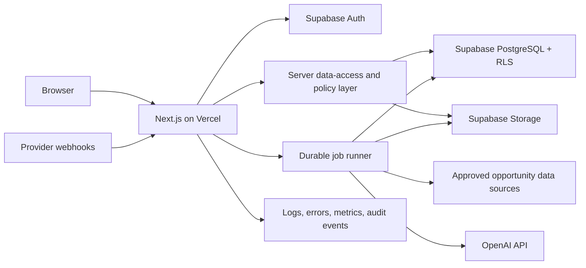

# Business Operating Platform Architecture

## 1. Purpose

This document defines the initial technical architecture for a multi-tenant SaaS platform with two products:

- **DealFlow AI** — acquisition opportunity discovery, analysis, scoring, and pipeline management.
- **Workforce Platform** — employee records, workforce documents, certifications, training, PTO, and reporting.

The immediate goal is a secure modular foundation and a narrow DealFlow AI MVP. It is not to build every long-term feature at once.

## 2. Repository and Environment Baseline

Inspected on July 25, 2026.

| Area | Current state |
|---|---|
| Computer | Apple Silicon (`arm64`), macOS 26.3 |
| Runtime | Node.js 24.16.0, npm 11.13.0 |
| Framework | Next.js 16.2.11, App Router |
| UI | React 19.2.4, Tailwind CSS 4 |
| Language | TypeScript 5, strict mode |
| Linting | ESLint 9 with Next.js core-web-vitals and TypeScript rules |
| Source layout | Root-level `app/`; no `src/` directory |
| Package alias | `@/*` maps to the repository root |
| Current application | Unmodified Create Next App starter |
| Version control | Git repository with one initial commit and clean working tree |
| Not yet present | Supabase, OpenAI SDK, validation library, test framework, CI, monitoring, billing, localization |

The repository's `AGENTS.md` warns that the installed Next.js version has breaking changes. Before implementation, contributors must read the relevant bundled guidance under `node_modules/next/dist/docs/` rather than rely on older Next.js conventions.

## 3. Architectural Decisions

### 3.1 Modular monolith first

Use one Next.js application and one PostgreSQL database, organized into clear product modules. This provides:

- one authentication and organization model;
- one deployment and operational surface;
- shared billing, localization, notifications, audit, and AI infrastructure;
- transactional consistency without distributed-system complexity.

Separate services should be introduced only when measured load, security isolation, team ownership, or background-processing needs justify them. A microservice architecture now would increase cost and failure modes without improving the MVP.

### 3.2 Multi-tenancy through organizations

An organization is the primary tenant and security boundary. A user may belong to multiple organizations through memberships. Every tenant-owned row must contain `organization_id`, and authorization must validate active membership and role.

Protection is layered:

1. authenticated user identity;
2. server-side authorization;
3. PostgreSQL Row Level Security (RLS);
4. database constraints;
5. audit logs for sensitive actions.

The user interface is never an authorization boundary.

### 3.3 Server-first Next.js

Use React Server Components by default. Client Components are reserved for browser-only APIs and interactive state. All privileged operations run on the server.

- **Server Actions**: first-party form mutations tightly coupled to the UI.
- **Route Handlers**: public/integration APIs, webhooks, downloads, and streaming.
- **Server-side data access layer**: the only application layer permitted to perform privileged database operations.

No service-role database key or OpenAI key may be exposed to browser code.

### 3.4 Supabase as managed platform

Use Supabase for:

- PostgreSQL;
- authentication;
- RLS;
- object storage;
- optional realtime updates where the product proves a need.

Use SQL migrations as the source of truth. Production schema changes must be reviewed and applied through an automated migration workflow, not edited ad hoc in the Supabase dashboard.

### 3.5 Asynchronous work

Search ingestion, document parsing, deduplication, AI analysis, bulk exports, and notifications can exceed a request's safe execution time. Model these as durable jobs with status, attempt count, idempotency key, timestamps, and error details.

For the first MVP, use a Vercel-compatible durable job provider or Supabase-backed queue after a short proof of concept. Do not depend on a long-running web request or an in-memory queue. Provider selection is an implementation-phase decision.

## 4. Logical Architecture



## 5. Proposed Repository Structure

This is a target structure, not an instruction to create every directory immediately.

```text
app/
  [locale]/
    (public)/
    (auth)/
    (platform)/
      [organizationSlug]/
        dashboard/
        dealflow/
        workforce/
  api/
    v1/
    webhooks/
components/
  ui/
  shared/
features/
  auth/
  organizations/
  dealflow/
  workforce/
  ai/
  notifications/
lib/
  auth/
  db/
  permissions/
  validation/
  i18n/
  observability/
  security/
supabase/
  migrations/
  seed.sql
tests/
  unit/
  integration/
  e2e/
```

Feature modules should own their UI, validation, domain logic, and data-access functions. Shared code belongs in `lib/` only when it is genuinely cross-cutting.

## 6. Identity, Organizations, and Authorization

Supabase Auth owns credentials and sessions. The application database owns profiles, organizations, memberships, roles, and permissions.

Initial organization roles:

- `owner`: full tenant control, billing, and ownership transfer;
- `admin`: user and product administration except ownership/billing restrictions;
- `dealflow_manager`: manage all DealFlow records and settings;
- `dealflow_member`: work on DealFlow records according to assigned permissions;
- `workforce_admin`: manage workforce records, including approved sensitive fields;
- `manager`: view/manage permitted direct reports;
- `employee`: view permitted self-service information;
- `viewer`: read-only access to explicitly allowed product data.

Roles are a starting point. Sensitive actions should map to named permissions in application code so roles can evolve without scattering string comparisons.

Authorization rules:

- verify the session on every protected server operation;
- derive user identity from the session, never from request input;
- require an active organization membership;
- scope queries by `organization_id`;
- use RLS as defense in depth;
- prevent a user from changing their own role or tenant;
- require step-up confirmation for ownership transfer, exports, and destructive actions;
- audit role, compensation, document, AI, and deal-status changes.

## 7. Product Boundaries

### Shared platform

Authentication, organizations, memberships, permissions, user preferences, localization, files, notifications, audit logs, subscriptions, usage tracking, AI execution records, and job execution records.

### DealFlow AI

Source records, normalized opportunities, source links, deduplication, searches, saved opportunities, analysis runs, scoring versions, score results, pipeline stages, tasks, notes, comparisons, and later due-diligence artifacts.

### Workforce

Employees, employment records, departments, reporting relationships, documents, certifications, training, PTO policies/requests/balances, announcements, and reporting.

Workforce compensation and documents have stricter access policies than ordinary organization records. Payroll calculation, tax filing, and money movement are explicitly outside the initial scope.

## 8. AI Architecture and Trust Boundaries

AI is an analytical assistant, not a source of record.

Every AI result must preserve:

- input source references and an input snapshot or hash;
- model/provider identifier;
- prompt-template version;
- scoring-methodology version when applicable;
- structured output validated against a schema;
- generation time, status, latency, and token/cost metadata;
- confidence and missing-information fields;
- human corrections or acceptance separately from original output.

Required pipeline:

1. retrieve tenant-authorized records;
2. construct a minimal, labeled input;
3. isolate untrusted source text from system instructions;
4. call the model with a versioned prompt and structured-output schema;
5. validate the response;
6. reject or quarantine malformed output;
7. store the result as AI-generated data with provenance;
8. show citations to source fields and a visible AI label.

Prompt-injection controls:

- treat listings, documents, emails, and pasted text as untrusted data;
- never allow source text to supply system instructions or tool authority;
- use an explicit allowlist of tools and data fields;
- do not place secrets in prompts;
- cap input sizes and supported file types;
- scan uploads and extracted content;
- require human approval before external communication or offer generation;
- log model calls without retaining secrets or unnecessary personal data.

The explainable score should be deterministic where possible: calculate weighted factors in application code from normalized values, then use AI to explain the result and identify missing information. A methodology version freezes weights, thresholds, and factor definitions for reproducibility.

## 9. Data Separation

The platform maintains five distinct categories:

| Category | Meaning | Example |
|---|---|---|
| Source data | Unchanged evidence from a provider or document | Listing's stated revenue |
| Normalized data | Parsed/canonical representation with provenance | Revenue converted to annual USD |
| User data | Human-entered or corrected information | User's diligence note |
| AI-generated data | Model-created summaries or recommendations | Executive summary |
| AI-inferred data | Model-derived proposition not stated by a source | Possible owner-dependency risk |

Rules:

- retain source provenance for every normalized field;
- use `null` plus missing-data metadata for unknown values—never convert missing to zero;
- never overwrite source data with normalized, user, or AI values;
- display data category and origin where ambiguity could affect a decision;
- preserve superseded analyses for auditability;
- let authorized users correct normalized data without rewriting the original evidence.

## 10. Localization

Internationalization begins in the platform foundation, even though full Spanish product copy is phased.

- Supported initial locales: `en` and `es`.
- Store each user's locale and time zone.
- Keep interface copy in version-controlled translation catalogs; do not hard-code it in components.
- Use locale-aware formatting for dates, times, numbers, and currency.
- Store canonical values independently of display language.
- User-authored content is not automatically translated or overwritten.
- AI translation, if offered, is stored as a labeled derivative with source language, target language, model, and timestamp.
- Legal, compliance, policy, and safety-sensitive translations require human review.
- Test text expansion, accented characters, pluralization, and keyboard/screen-reader behavior.

## 11. Security and Privacy

Minimum controls:

- secure, HTTP-only session cookies managed by the auth provider;
- RLS enabled on every tenant-owned table before production data is introduced;
- schema validation at every server boundary;
- parameterized queries or safe client APIs;
- CSRF protections appropriate to Server Actions and Route Handlers;
- rate limiting for auth, search, exports, uploads, and AI endpoints;
- restrictive file types, file-size limits, malware scanning, and signed storage URLs;
- Content Security Policy and standard security headers;
- secrets stored only in environment managers, with separate development/preview/production values;
- redaction of credentials, tokens, sensitive workforce data, and unnecessary PII from logs;
- encrypted transport and provider-managed encryption at rest;
- dependency, secret, and static-analysis checks in CI;
- backups and tested restore procedures;
- retention and deletion policies by data class;
- incident-response ownership and audit-log retention.

Do not claim regulatory compliance until legal counsel and a formal control review establish the applicable obligations. Workforce data may trigger employment, privacy, and records-retention duties that vary by jurisdiction.

## 12. Reliability, Observability, and Scalability

- Correlation IDs connect requests, jobs, AI calls, and provider webhooks.
- Structured logs record events, not raw sensitive payloads.
- Error monitoring covers browser, server, job, and webhook failures.
- Metrics cover latency, failure rate, queue age, AI cost, token usage, ingestion volume, duplicate rate, and score coverage.
- Webhooks are signed, replay-protected, idempotent, and retry-safe.
- External source connectors use backoff, rate limits, and provider-specific adapters.
- Database indexes follow measured query patterns and tenant scope.
- Keyset pagination is preferred for large opportunity and employee lists.
- Expensive reports and exports run asynchronously.

Initial service objectives should be modest and explicit after the MVP usage profile is known. Scaling should be based on observed bottlenecks, not hypothetical traffic.

## 13. Deployment

Use separate Supabase projects and Vercel environments:

- local development;
- preview/staging;
- production.

Deployment flow:

1. pull request runs lint, type checking, tests, migration checks, and security scans;
2. Vercel creates an isolated preview;
3. reviewed migrations apply to staging before production;
4. production deployment uses approved environment variables;
5. smoke tests validate login, tenant isolation, and core DealFlow actions;
6. monitoring verifies the release;
7. application rollback and forward-compatible database recovery procedures are documented.

Never connect preview deployments to the production database. Database migrations should be backward compatible across a rolling web deployment whenever practical.

## 14. Explicit Non-Goals for the First MVP

- payroll calculation, filings, payments, or tax compliance;
- autonomous broker outreach or autonomous offer submission;
- scraping sources without confirmed contractual and legal permission;
- black-box acquisition scoring;
- microservices or multiple separately deployed frontends;
- custom authentication or billing engines;
- real-time collaboration unless a validated user need appears;
- native mobile applications.

## 15. Open Decisions Before Implementation

1. Which opportunity data sources are legally and technically available?
2. Who is the first narrow customer segment and what is their highest-value workflow?
3. What scoring weights and thresholds will a qualified acquisition practitioner approve?
4. Which jurisdictions and workforce-data obligations apply?
5. What identity methods are required at launch: password, magic link, social, or SSO?
6. What billing model and trial behavior should the schema reserve?
7. What retention, export, and deletion promises will be made?
8. Which durable job provider best fits Vercel, Supabase, expected volume, and budget?

